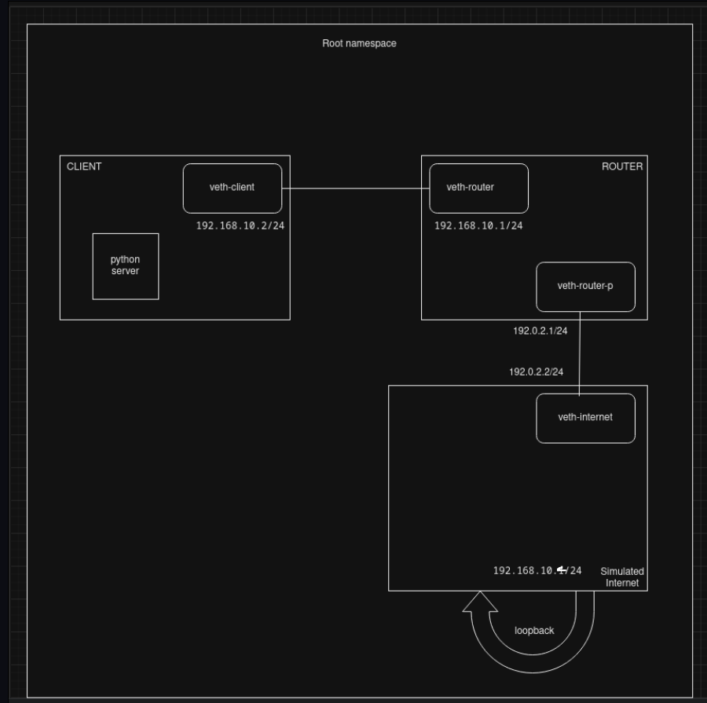

# NAT(Network Address Translation) Task
Name: Ananya A K
<br>
Roll No: 231CS208
## Tasks completed:
1. Create a network topology consisting of:
      - Private LAN (192.168.10.0/24): At least one client node.
      -  Router: Acts as the NAT gateway with an external public IP.
      - The topology should look like this: |Client| <--------> |Router (NAT)| <--------> |Internet (Simulated Public Network)|
2. Implement NAT using Linux network namespaces and iptables to allow the private network (LAN) to access the simulated internet through the router's public IP.
3. [Bonus] Configure Port Forwarding:
      - Host a simple web server (using Python, Apache, etc.) on the LAN client.
      - Forward requests from the "internet" to the internal web server using the router's public IP.
4. [Bonus] Restrict outbound traffic from the LAN to allow only HTTP and HTTPS connections.  <br>
## Topology


## To run commands as root:
```bash
sudo su
```
Note: Root privileges is needed use namespaces. Alternatively, sudo can be prefixed before every command below.
## TASK1:  
Topology: | Client (192.168.10.2/24) | <--------> | Router (NAT) (192.168.10.1/24) | <--------> | Internet (Simulated Public Network)|
### Create Network Namespaces:
Create a namespace named client and then another named router
```bash
ip netns add client 
ip netns add router
```
To check if the namespaces were created
```bash
ip netns list
```
Note: client and router must be listed
### Create Virtual Ethernet Pairs:  
Create a link or a virtual cable and name the ends as veth-client and veth-router
```bash
ip link add veth-client type veth peer name veth-router
```
To check if veth pair was created
```bash
ip link list
```
Note: veth-router@veth-client and veth-client@veth-router must be listed
### Assign Interfaces to Namespaces:                                                                    
Assign each end of the link or virtual cable to the specific namespace
```bash
ip link set veth-client netns client
ip link set veth-router netns router
```
To check assignment to specific namespaces
```bash
ip netns exec client ip link list
```
```bash
ip netns exec router ip link list
```
Note 1: veth-client@ and veth-router@ must be displayed in the respective namespace lists.<br>
Note 2: Running 'ip link list', doesn't show veth-router or veth-client anymore as the have been assigned to their respective namespaces
### Assign IP Addresses:                                                   
For the client:                                                                           
Assign ip to client 
```bash
ip netns exec client ip addr add 192.168.10.2/24 dev veth-client
```                          
Get the link up and running
```bash
ip netns exec client ip link set veth-client up
```                                                            
For the router (NAT gateway):       
Assign ip to router
```bash
ip netns exec router ip addr add 192.168.10.1/24 dev veth-router
```                                
Get the link up and running
```bash
ip netns exec router ip link set veth-router up
```
<!-- For loopback: ip netns exec client ip link set lo up -->
### Create a Simulated Public Network:

A namespace named "internet" is created with a public ip(192.0.2.2/24) and link is made between the router and internet. Loopback is used to simulate the traffic going through various nodes and finally reaches the router of the internet, finally to be sent to destination router. Public ip of the router is set as 192.0.2.1/24.
```bash
ip netns add internet
ip link add veth-router-p type veth peer name veth-internet
ip link set veth-router-p netns router
ip link set veth-internet netns internet
ip netns exec router ip addr add 192.0.2.1/24 dev veth-router-p
ip netns exec internet ip addr add 192.0.2.2/24 dev veth-internet
ip netns exec router ip link set veth-router-p up
ip netns exec internet ip link set veth-internet up
ip netns exec internet ip addr add 192.168.10.4/24 dev lo
ip netns exec internet ip link set lo up
```
~~:~~
<br>
Note:
Lopback on "internet" router is used to simulate the internet. This is done because whenever<br>
a request is sent to a server using ip, data packets are obtained through that same router(here "internet" roueter.<br>
The data maybe present in that server itself or needs to be fetched from other server(s).<br>
We can abstract these parts for the "simualated internet" using loopback.
### Route traffic from client to intenet through the router: 
Add a route in the client namespace to reach the internet via the router
```bash
ip netns exec client ip route add 192.0.2.0/24 via 192.168.10.1
```
Note: This command is necessary to ensure that the requests from the client namespsce to the "internet" goes through the router. If not, then ping will give the following error- 
```
Error:ping: connect: Network is unreachable
```
Check if the route is in the client namespace
```bash
ip netns exec client ip route
```
Note: The output should look something like-
```
192.0.2.0/24 via 192.168.10.1 dev veth-client
192.168.10.0/24 dev veth-client proto kernel scope link src 192.168.10.2
```
## TASK2:
### Enable IP Forwarding: 
Enable IP forwarding on the router, allowing it to route packets between the client and the simulated public network.
```bash
ip netns exec router sysctl -w net.ipv4.ip_forward=1
```
Alternatively, the following command can be used to se
```bash
echo 1 > /proc/sys/net/ipv4/ip_forward
```
The above two methods do not make the changes persistent.
To make the changes persistent, apply changes to the /etc/sysctl.conf file(nano editor used here).
```bash
nano /etc/sysctl.conf
```
After editing the file, to make the changes take effect right away.
```bash
sysctl -p
```
### Set up NAT on the router: 
Sets up a NAT rule in the router namespace that will perform IP Masquerade on packets leaving the router namespace, allowing the client to access the simulated public network through the router's public IP.
```bash
ip netns exec router iptables -t nat -A POSTROUTING -o veth-router-p -j MASQUERADE
```
<!--
NAT for incoming traffic to reach the right namespace
```bash
ip netns exec router iptables -t nat -A PREROUTING -i veth-router-p -j ACCEPT
```
Router forwards the traffic to the destination namespace
```bash
ip netns exec router iptables -A FORWARD -d 192.168.10.2 -j ACCEPT
```
-->
###Ping to test the working or connectivity.
```bash
ip netns exec client ping 192.0.2.1
```
Note: **Use Ctrl+C to stop pinging :)**
The terminal should look something like the following on sucess:
```
PING 192.0.2.1 (192.0.2.1) 56(84) bytes of data.
64 bytes from 192.0.2.1: icmp_seq=1 ttl=64 time=0.075 ms
64 bytes from 192.0.2.1: icmp_seq=2 ttl=64 time=0.049 ms
64 bytes from 192.0.2.1: icmp_seq=3 ttl=64 time=0.260 ms
^C
--- 192.0.2.1 ping statistics ---
3 packets transmitted, 3 received, 0% packet loss, time 2061ms
rtt min/avg/max/mdev = 0.049/0.128/0.260/0.093 ms
```
Alternatively, to send a specific number of packets, -c flag followed by the number of packets can be used.
```bash
ip netns exec client ping 192.0.2.1 -c 4
```
## TASK3:
### Host a simple web server (using Python) on the LAN client: 
A simple web server is hosted using Python's built-in http.server module.
```bash
ip netns exec client python3 -m http.server 80
```
**Note: Port 80 is used here. But if it is running anothre service, any other free port(ex., 8000) maybe used. Also, change to correct port number in the subsequent commnads below as well**
### Forward requests to the web server
```bash
ip netns exec router iptables -t nat -A PREROUTING -p tcp --dport 80 -j DNAT --to-destination 192.168.10.2:80
```
Forwarding all types of traffic
```bash
ip netns exec router iptables -A FORWARD -p tcp -d 192.168.10.2 --dport 80 -j ACCEPT
```
## TASK4:
### Allow only HTTP(port 80) and HTTPS(port 443) traffic
```bash
ip netns exec router iptables -A FORWARD -p tcp --dport 80 -j ACCEPT
ip netns exec router iptables -A FORWARD -p tcp --dport 443 -j ACCEPT
ip netns exec router iptables -A FORWARD -j DROP
```
## To remove the namespaces and virtual cables/links
```bash
ip netns del client
ip netns del router
ip netns del internet
ip link del veth-client
ip link del veth-router
ip link del veth-router-p
ip link del veth-internet
```
